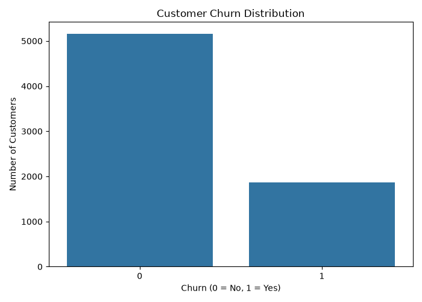
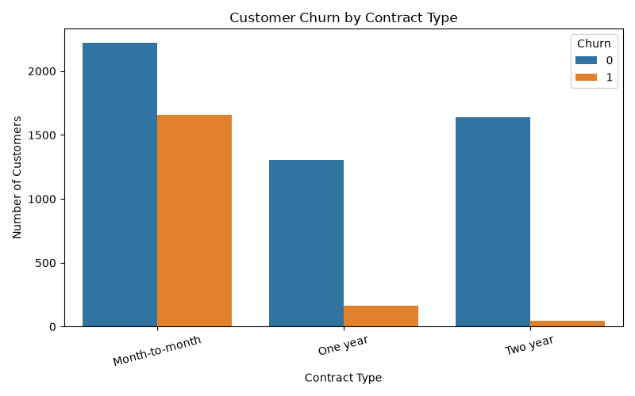
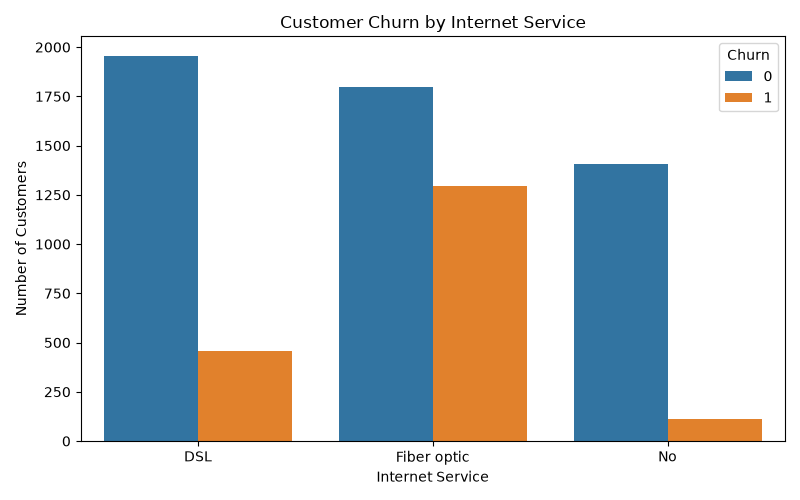
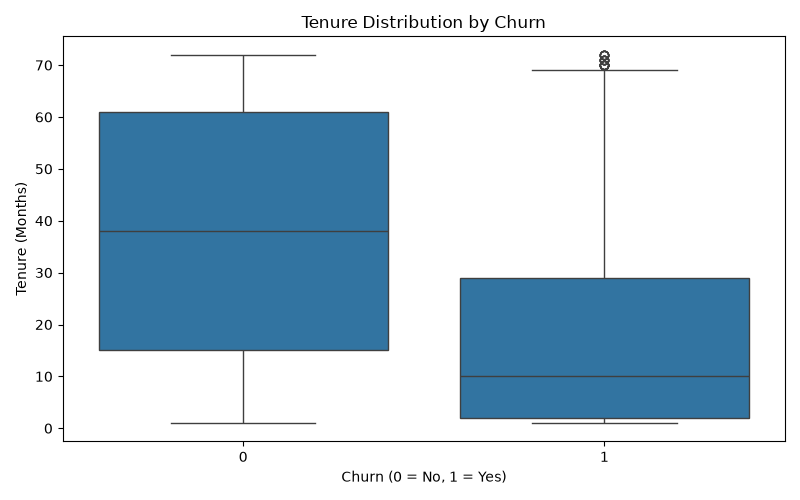
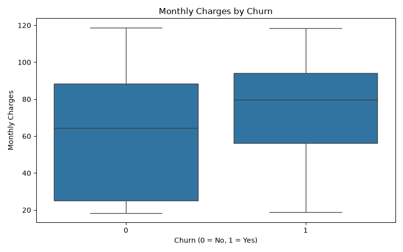
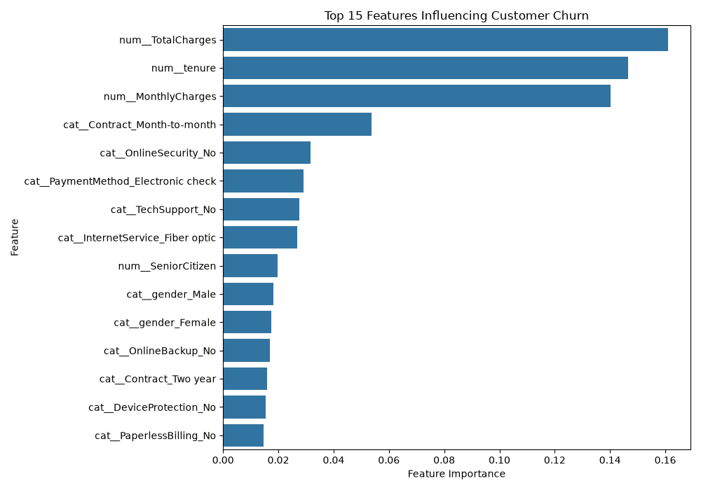
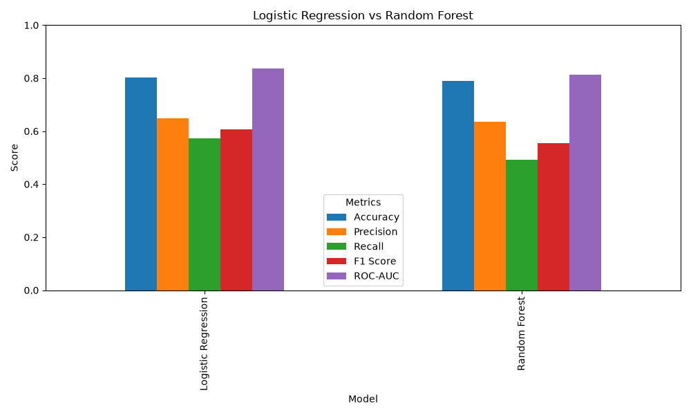
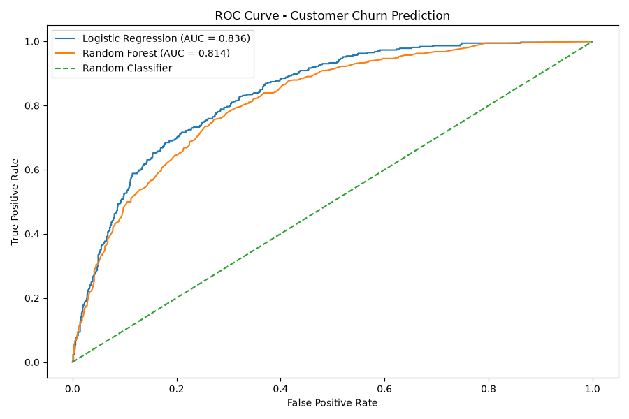
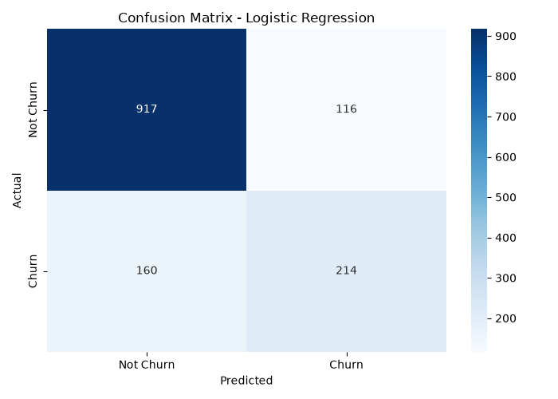

# 🤖 Customer Churn Prediction

A machine learning web application that predicts whether a customer is likely to churn based on customer demographics, services, contract details, and billing information.

## 🚀 Project Overview

Customer churn is an important business problem. This project uses machine learning classification algorithms to identify customers who may be at risk of leaving.

The complete pipeline includes:

Dataset → Data Cleaning → Feature Engineering → Classification → Model Evaluation → Prediction → Streamlit → Deployment

## 📊 Exploratory Data Analysis

The project performs Exploratory Data Analysis (EDA) to understand customer churn patterns and identify important relationships between customer characteristics and churn behavior.

### Churn Distribution

The dataset contains **7,032 customers** after data cleaning.

- 👤 **5,163 customers (73.42%)** did not churn.
- ⚠️ **1,869 customers (26.58%)** churned.



### Churn by Contract Type

Contract type is analyzed to understand how customer contracts relate to churn behavior.



### Churn by Internet Service

Internet service type is analyzed to identify differences in churn behavior across service categories.



### Tenure vs Churn

Customer tenure is analyzed to understand whether customers with different lengths of service show different churn patterns.



### Monthly Charges vs Churn

Monthly charges are analyzed to understand their relationship with customer churn.



## 🧠 Feature Importance

Random Forest feature importance was used to identify the customer attributes that contributed most to the model's churn predictions.

The analysis helps understand which customer characteristics have the strongest influence on churn prediction.



### 🔍 Why Feature Importance Matters

Feature importance provides interpretability by showing which variables contribute most to the model's decisions.

This can help businesses identify customer characteristics associated with higher churn risk and potentially develop targeted retention strategies.

## 📊 Model Performance

The project compares Logistic Regression and Random Forest using multiple classification metrics.

| Metric | Description |
|---|---|
| Accuracy | Overall percentage of correct predictions |
| Precision | How many predicted churn customers actually churned |
| Recall | How many actual churn customers were identified |
| F1 Score | Balance between precision and recall |
| ROC-AUC | Ability of the model to distinguish between churn and non-churn customers |

The final model is selected based on F1 Score.

### 🏆 Model Comparison

Two classification models were evaluated using the same training and testing data.

| Model | Accuracy | Precision | Recall | F1 Score | ROC-AUC |
|---|---:|---:|---:|---:|---:|
| **Logistic Regression** | **80.38%** | **64.85%** | **57.22%** | **60.80%** | **83.59%** |
| Random Forest | 78.96% | 63.45% | 49.20% | 55.42% | 81.40% |

### 📊 Model Comparison Visualization

The chart below compares Logistic Regression and Random Forest across Accuracy, Precision, Recall, F1 Score, and ROC-AUC.



### 📈 ROC Curve

The ROC curve compares the ability of Logistic Regression and Random Forest to distinguish between customers who churn and customers who do not churn.

A higher ROC-AUC indicates better classification performance.



**ROC-AUC Results:**

- Logistic Regression: **83.59%**
- Random Forest: **81.40%**

Logistic Regression achieved the higher ROC-AUC score and was selected as the preferred model.

### 🥇 Selected Model

**Logistic Regression** achieved the highest performance across the evaluated metrics and was selected as the preferred model for customer churn prediction.

The model achieved:

- **Accuracy:** 80.38%
- **Precision:** 64.85%
- **Recall:** 57.22%
- **F1 Score:** 60.80%
- **ROC-AUC:** 83.59%

### 📊 Confusion Matrix

The confusion matrix shows the model's correct and incorrect predictions for churn and non-churn customers.



## 🌐 Live Demo

🚀 **Live App:** https://customer-churn-prediction-xxzbq3mo5xmriiaatfwadp.streamlit.app/

The deployed application allows users to enter customer information and receive:

- Churn prediction
- Churn probability
- Risk assessment
- Customer summary

## 🧠 Machine Learning Workflow

### 1. Data Cleaning
- Removed unnecessary customer ID
- Converted TotalCharges into numeric format
- Handled missing values
- Checked data types and distributions

### 2. Feature Engineering
- Separated features and target
- Converted Churn into binary values
- Identified numerical and categorical features
- Applied StandardScaler to numerical features
- Applied OneHotEncoder to categorical features

### 3. Classification Models

The project evaluates:

- Logistic Regression
- Random Forest Classifier

### 4. Model Evaluation

Models are evaluated using:

- Accuracy
- Precision
- Recall
- F1 Score
- ROC-AUC
- Confusion Matrix

### 5. Prediction

The trained model predicts:

- Likely to Churn
- Not Likely to Churn

It also provides a churn probability.

### 6. Streamlit Application

The interactive dashboard allows users to enter customer information and receive an instant churn prediction.

## 🛠️ Tech Stack

- Python
- Pandas
- NumPy
- Scikit-learn
- Matplotlib
- Seaborn
- Joblib
- Streamlit

## 📁 Project Structure

```text
customer_churn_prediction/
│
├── data/
│   └── customer_churn.csv
│
├── models/
│   ├── churn_model.pkl
│   ├── preprocessor.pkl
│   └── confusion_matrix.png
│
├── notebooks/
│
├── app.py
├── predict.py
├── train_model.py
├── requirements.txt
├── README.md
└── .gitignore
```
---
## ▶️ Run Locally
Clone the repository and install the dependencies:
```bash
pip install -r requirements.txt
```
Run the Streamlit application:
```bash
streamlit run app.py
```
## 🎯 Key Skills Demonstrated
- Data Cleaning
- Exploratory Data Analysis
- Feature Engineering
- Classification
- Model Training
- Model Evaluation
- Probability Prediction
- Machine Learning Pipelines
- Streamlit
- Git & GitHub
- Deployment

## ⚠️ Disclaimer

The prediction is generated by a machine learning model and represents an estimate rather than a guarantee of customer behavior.